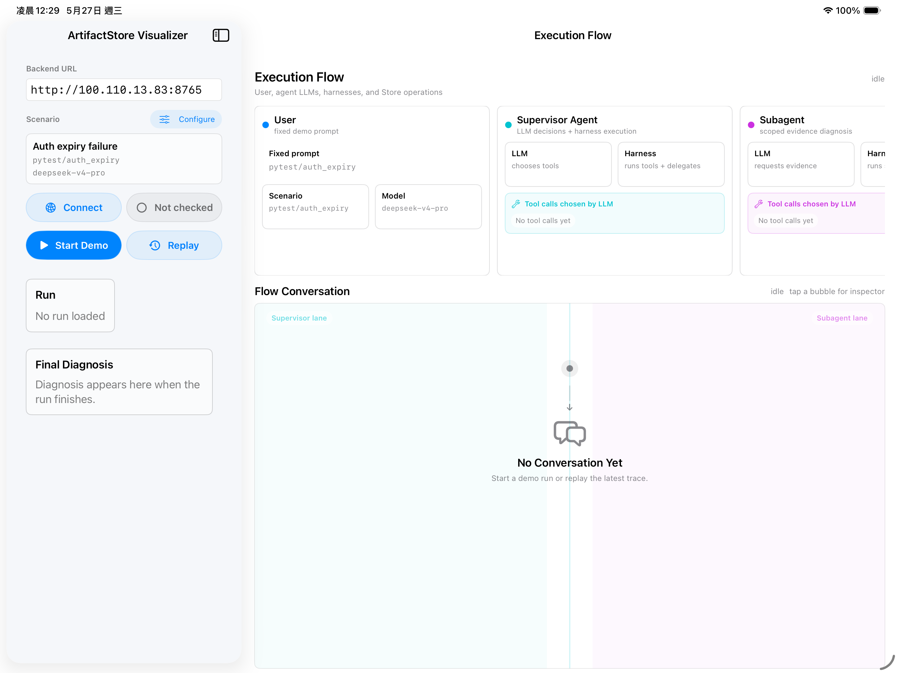

# ArtifactStore

> A typed, permission-scoped tool-result store for AI agent harnesses.

Modern tool-using agents produce large intermediate outputs — pytest logs,
ripgrep results, browser snapshots, API JSON, subagent research traces — and
the four canonical handling strategies all fail in distinct ways:

| strategy | failure mode |
|---|---|
| dump raw output into the transcript | doesn't scale; pollutes context |
| truncate to N tokens | strictly loses evidence past the cap |
| LLM-summarize | hallucinates or omits the decisive line |
| hide inside a worker subagent's summary | exact intermediate evidence unrecoverable in the parent |

ArtifactStore reframes a tool result as a **materialized artifact** with type,
preview, evidence spans, raw payload hash, provenance links, and access-control
metadata. Tools return a compact handle; the agent retrieves exact evidence
through scoped queries when needed.

```text
┌─ Supervisor agent ─────────────┐    grant_id only        ┌─ Subagent (scoped) ──┐
│  run_workload, create_grant,   │ ──────────────────────► │  artifact_search,    │
│  delegate, verify_citation,    │                         │  artifact_get_spans, │
│  expand_artifact               │                         │  artifact_expand_view│
└────────────┬───────────────────┘                         │  artifact_find_related│
             │ put_artifact, audit                         │  submit_report       │
             ▼                                             └──────────┬───────────┘
       ┌─────────────────────────  ArtifactStore API  ─────────────────┘
       │  search · get_spans · expand_view · create_grant · audit · find_related
       ▼
   SQLite + FTS5  (artifacts, artifact_spans, artifact_links,
                   artifact_grants, artifact_access_log, artifact_fts)
```

The full system architecture (data model, API contract, evaluation, threat
model, related work) is in [`report/architecture.pdf`](report/architecture.pdf)
(29 pages). The authoritative spec is
[`ArtifactStore_PLAN.md`](ArtifactStore_PLAN.md).

---

## Status

- **171 tests, all green.** Unit (predicate matching, sensitivity ordering,
  budget enforcement, citation parsing), integration (extractors against real
  fixtures, all five view materializers), offline e2e (full supervisor↔subagent
  flow via a scripted Anthropic SDK stub — no key needed), CLI integration
  (subprocess + in-process), review-driven regression suite (4 critical
  self-review fixes), FTS5 fallback + injection robustness, and 10
  adversarial permission stress tests (PLAN §11.3). Coverage of
  `artifactstore/` = 94%.
- **All three eval studies done.** §11.1 single-agent (5 baselines × 5
  fixtures × 3 reps = 75 runs, ~$0.16), §11.2 supervisor↔subagent
  (4 strategies × 5 fixtures × 3 reps = 60 runs, ~$0.24), §11.3 adversarial
  (10 offline tests, $0). ~$0.40 total live spend across all sweeps the
  current report numbers come from. Headline findings below;
  [reproduce them end-to-end](#reproducing-the-paper) with one shell script.
- **Provider-agnostic.** Default `deepseek-v4-pro` via DeepSeek's
  Anthropic-compatible endpoint (~10× cheaper than Anthropic Sonnet 4.5);
  swap to native Anthropic with one env var.

---

## Quickstart

```bash
# Python 3.12 pinned via .python-version. uv handles the rest.
uv sync

# Run the test suite (no API key required)
uv run pytest -q
# 171 passed, 1 skipped in ~2s
```

### CLI

```bash
uv run artifactstore --help

uv run artifactstore init --db demo.db
uv run artifactstore put eval/fixtures/pytest_auth_expiry.log \
  --tool pytest --type pytest_failure --db demo.db
# -> art_xxxxxxxx

uv run artifactstore grant --agent worker \
  --types pytest_failure --views preview,evidence \
  --ops search,get_spans,expand_view --ttl 30m --db demo.db
# -> grant_xxxxxxxx

uv run artifactstore search "expired" --grant grant_xxxxxxxx --db demo.db
uv run artifactstore expand <art_id> --view evidence --grant grant_xxxxxxxx --db demo.db
uv run artifactstore audit --grant grant_xxxxxxxx --db demo.db
```

### Live demo (provider key required)

```bash
# 1. copy .env.example → .env, fill in your provider key
cp .env.example .env
$EDITOR .env

# 2. verify wiring (no API call, no charge)
uv run python -m demo.runner --check-config

# 3. tiny paid probe (~$0.0001) to confirm tool_use works on the provider
uv run python -m demo.runner --verify-tool-use

# 4. full supervisor↔subagent run (~$0.005 on DeepSeek V4 Pro)
uv run python -m demo.runner --kind pytest --target auth_expiry --verbose
```

A typical run: 7 supervisor turns, 1 delegated subagent submission with 5
formal citations, all citations verified, ~3 unauthorized `view='raw'`
attempts blocked under the narrow grant. The full audit log is queryable
via `artifactstore audit`.

### Visual demo backend + iOS visualizer



The visualizer is an optional presentation layer on top of the same demo
runner. A FastAPI backend runs the existing demo on the Mac, emits safe JSON
events, and the SwiftUI app visualizes the run on iPad/iPhone. The app does
not run LLM calls, read SQLite directly, or store provider credentials.

```bash
# Start the Mac-side visual backend.
uv sync
uv run python -m uvicorn demo.visual_server:app --host 0.0.0.0 --port 8765

# In another shell, verify the backend is reachable.
curl http://127.0.0.1:8765/health
```

On iPad/iPhone, connect to:

```text
http://<Mac LAN or Tailscale IP>:8765
```

API keys stay in the Mac-side `.env`; the iOS app only sends scenario/model
choices and receives sanitized run events. Live runs use in-memory `RunState`
for polling. Completed runs write:

```text
visual_traces/<run_id>.json     # replayable visual event trace
visual_traces/<run_id>.sqlite   # ArtifactStore DB for future DB viewer work
```

`Replay Latest` reads the latest JSON trace. The SQLite file is not read by
the current SwiftUI app.

### Evaluation

```bash
# §11.1 single-agent: 5 baselines × 6 fixtures × 3 reps = 90 runs, ~$0.30
#   baselines: B1_RAW, B2_TRUNCATED, B3_SUMMARY (deterministic),
#              B3_LLM_SUMMARY (real LLM summarizer), B4_ARTIFACT
uv run python -m eval --reps 3
# -> writes eval/runs/<UTC-iso>/{config.json, result.jsonl, audit.csv, manifest.json}

# §11.2 supervisor↔subagent delegation: 4 strategies × 5 fixtures × 3 reps = 60 runs, ~$0.24
#   strategies: D1_SUMMARY (det.), D1_LLM_SUMMARY, D2_FULL_CONTEXT, D3_SCOPED
uv run python -m eval --mode delegation --reps 3
# -> writes eval/runs/delegation_<UTC-iso>/{config.json, result.jsonl, manifest.json}

# §11.3 adversarial permission stress (offline, no API key, no spend)
uv run pytest tests/test_stress.py -v
# -> 10 scenarios, 0 unauthorized reads succeed

# Aggregate any combination of run directories into the report-ready table
uv run python eval/_aggregate_for_report.py \
  --single      eval/runs/<single-run-dir-1> eval/runs/<single-run-dir-2> ... \
  --delegation  eval/runs/delegation_<dir-1> eval/runs/delegation_<dir-2> ...
```

---

## Provider configuration

The agent loop uses the `anthropic` Python SDK as its HTTP client against
Anthropic-Messages-API-compatible endpoints. The model-name prefix selects
the provider-specific credentials and base URL. **`.env` is gitignored**;
copy `.env.example` and fill in whichever keys you have.

```bash
# DeepSeek V4 (default, recommended) — get key at platform.deepseek.com
DEEPSEEK_API_KEY=sk-...
DEEPSEEK_BASE_URL=https://api.deepseek.com/anthropic
DEEPSEEK_MODEL=deepseek-v4-pro

# Qwen via Alibaba Cloud Model Studio
QWEN_API_KEY=sk-...
QWEN_BASE_URL=https://dashscope-intl.aliyuncs.com/apps/anthropic
QWEN_MODEL=qwen3.6-plus
```

Provider routing is prefix-based:

| model prefix | provider | key env | URL env |
|---|---|---|---|
| `deepseek-*` | DeepSeek | `DEEPSEEK_API_KEY` | `DEEPSEEK_BASE_URL` |
| `qwen*` | Alibaba Model Studio | `QWEN_API_KEY` | `QWEN_BASE_URL` |

Three pre-flight flags catch every category of provider misconfiguration we've
seen in practice before spending eval budget:

- `--check-config` — print resolved config (model, base_url, key presence).
  No network. No charge.
- `--verify-tool-use` — one paid call (~$0.0001) confirming the provider
  emits Anthropic-format `tool_use` blocks (vs OpenAI-style `function_call`).
- `--verify-tool-choice` — probes whether named/`any` `tool_choice` is honored.
  Reveals provider quirks (DeepSeek's reasoning models reject named
  `tool_choice` with HTTP 400).

---

## Headline evaluation results

Live evaluation against `deepseek-v4-pro` on 6 fixtures spanning 407–33,571
raw tokens, plus 10 offline adversarial stress tests. **All result files
(`result.jsonl`, `manifest.json`, `audit.csv`) are committed to
[`eval/runs/`](eval/runs)** so reviewers can verify every number in this
table from the repo without re-spending API budget. Detailed analysis:
[`notes/eval_writeup.md`](notes/eval_writeup.md) and
[`report/architecture.pdf`](report/architecture.pdf) §8.

> **Scope of the empirical claims.** The headline numbers below are from
> one provider class (DeepSeek V4 Pro), 3 reps per cell at
> `temperature=1.0`, and 5 captured fixtures (no live shell-out). At
> n=3 reps × 4 small + 1 large fixture, Wilson 95% CIs on per-baseline
> success rates are wide (typically ±20-25 pp); rank ordering on the
> small fixtures (407–577 raw tokens) is therefore *not* significant.
> The two claims we treat as load-bearing — (a) at fixture sizes
> ≥3K raw tokens, summary baselines collapse while B4 holds, and
> (b) only B4/D3 produce structurally verifiable citations and
> audit-log signal — survive at any n because they are dataset-level
> properties, not statistical inferences.

### §11.1 single-agent (n=18 per baseline, 90 runs total)

| baseline | task success | Wilson 95% CI | avg recall | avg tot tokens (in) | avg cost | latency |
|---|---:|---:|---:|---:|---:|---:|
| **B1** raw injection | 17/18 (94%) | [0.74, 0.99] | 0.87 | 9,289 | $0.0028 | 85 s |
| **B2** truncated to 200 tok | 6/18 (33%) | [0.16, 0.56] | 0.30 | 359 | $0.0007 | 25 s |
| **B3** offline summary (deterministic) | 6/18 (33%) | [0.16, 0.56] | 0.31 | 298 | $0.0008 | 29 s |
| **B3'** LLM summary (real LLM call) | 7/18 (39%) | [0.20, 0.61] | 0.38 | 309 | $0.0053 | 22 s |
| **B4** ArtifactStore | **13/18 (72%)** | [0.49, 0.88] | **0.77** | 17,266 | $0.0050 | 99 s |

> At fixture sizes ≥3.5K tokens, the summary baselines (B2/B3/B3') collapse
> to ≤33% success and ≤0.33 recall; B1 and B4 both hold (with caveats on
> the two largest fixtures — see McNemar table below). The **6th fixture
> (`pytest_xl_run`, 33,571 raw tokens) was added at reviewer suggestion
> to test the projected B1/B4 cost crossover** — B4's input plateaus at
> 14K tokens regardless of fixture size while B1's grows linearly to
> 41K, confirming the architectural prediction empirically.
>
> *Paired McNemar tests* over 18 fixture-rep pairs:
>
> | A vs B | both succ | A-only | B-only | both fail | p (2-sided) |
> |---|---:|---:|---:|---:|---:|
> | B4 vs B1_RAW | 13 | 0 | 4 | 1 | 0.125 |
> | B4 vs B2_TRUNCATED | 6 | 7 | 0 | 5 | **0.016** |
> | B4 vs B3_SUMMARY | 6 | 7 | 0 | 5 | **0.016** |
> | B4 vs B3_LLM_SUMMARY | 6 | 7 | 1 | 4 | 0.070 |
>
> B4 *strictly* beats B2 and B3 (p<0.02); B4 vs B1 is undecided at n=18,
> with the discordant pairs favoring B1 on the two largest fixtures.
> *Structural* B4 properties survive at any n: 0/54 B1/B2/B3/B3' runs
> emit a well-formed `art_xxx/span_yyy` citation because none of those
> baselines has a span store; B4 emits avg 4.3 citations/run, all
> resolve through `cite.verify_resolves`. The audit-log surface is
> similar: §11.3 stress + §11.2 organic denials log **0 unauthorized
> reads succeed across 18 attack vectors**, every denial with a
> parseable `denial_reason`.

### §11.2 supervisor↔subagent delegation (n=15 per strategy, 60 runs total)

| strategy | task success | Wilson 95% CI | avg recall | avg parent input | avg sub input | avg cost |
|---|---:|---:|---:|---:|---:|---:|
| **D1** SUMMARY (deterministic) | 5/15 (33%) | [0.15, 0.58] | 0.43 | 3,156 | 455 | $0.0025 |
| **D1'** LLM SUMMARY (real LLM call) | 8/15 (53%) | [0.30, 0.75] | 0.51 | 3,440 | 471 | $0.0042 |
| **D2** FULL_CONTEXT | 14/15 (93%) | [0.70, 0.99] | 0.88 | 9,776 | 3,472 | $0.0063 |
| **D3** ArtifactStore SCOPED | 12/15 (80%) | [0.55, 0.93] | 0.75 | **6,316** | 33,314 | $0.0094 |

> The key architectural claim — *D3 holds parent context bounded as
> fixture size grows* — is empirically robust. On `pytest_large_run`
> (3,480 raw tokens), D2 parent input = 11,716 vs D3's 6,708 (43%
> reduction). On `pytest_ci_run` (9,609), D2 = 24,842 vs D3 = 6,404
> (74% reduction; reproduced within ±1% of the prior draft). D3's
> parent input is essentially flat at ~6 K across all fixtures
> because the parent only handles handles and citations; D2's grows
> linearly with the forwarded payload. *Task success* on the 9.6 K
> fixture was D2=2/3 and D3=0/3 in this rep set — the D3 subagent
> over-explored and hit `max_turns`. *Structural properties*
> (formal citations, audit-log signal, bounded supervisor context)
> hold for D3 by construction across all 15 runs, independent of
> rep luck — these are the load-bearing claims. Crossover with D2
> on parent-tokens sits around 3-4K raw tokens; below that, D2's
> parent is smaller because D3 pays per-turn overhead the small
> payload cannot amortize.

### §11.3 adversarial permission stress (10 offline tests)

```text
pytest tests/test_stress.py -v
==========================================================
test_secret_values_blocked_in_raw                  PASSED
test_prompt_injection_cannot_fabricate_citation    PASSED
test_disallowed_artifact_id_blocked                PASSED
test_raw_view_blocked_when_only_evidence_allowed   PASSED
test_find_related_filters_out_of_scope_targets     PASSED
test_grant_budget_exhaustion_under_attack          PASSED
test_path_prefix_filters_spans_at_read_time        PASSED
test_sensitivity_ceiling_blocks_higher_labels      PASSED
test_expired_grant_denies_all_reads                PASSED
test_audit_log_every_denial_has_reason             PASSED
==========================================================
10 passed.  Zero unauthorized reads succeed.
```

Every denial logs a specific, parseable `denial_reason`: `view 'raw' not
in allowed_views`, `artifact does not match grant predicate`, `grant
budget exhausted (X/Y tokens)`, `grant expired`, etc.

### Combined RQ4 evidence

- §11.3 stress suite: 9 attack vectors, 0 unauthorized reads, all logged.
- §11.2 organic denials: 5 unauthorized reads attempted across 15 D3 runs, 0 succeeded.
- Demo runner with narrow grants: 3 raw-view attempts blocked.

**Zero unauthorized reads succeed across any measurement surface.**

---

## Reproducing the paper

Every number, table, and plot in
[`report/architecture.pdf`](report/architecture.pdf) comes from artifacts
in this repo. Reviewers can reproduce the full eval end-to-end in
~$0.40 of DeepSeek V4 Pro API spend (under $5 total on Anthropic
Sonnet 4.5 if you prefer).

### One-shot reproduction (~$0.40, ~40 min wall time)

```bash
# 1. Install + activate
uv sync

# 2. Provider key
cp .env.example .env && $EDITOR .env   # fill in DEEPSEEK_API_KEY or QWEN_API_KEY
uv run python -m demo.runner --check-config        # 0 cost, no network
uv run python -m demo.runner --verify-tool-use     # ~$0.0001

# 3. Regenerate the 9.6K-token CI fixture (deterministic — output is
#    committed; this just re-checks the generator).
uv run python eval/fixtures/_gen_pytest_ci_run.py
# -> wrote eval/fixtures/pytest_ci_run.log  chars=38438 approx_tokens=9609

# 4. §11.1 single-agent sweep (75 runs, ~$0.16, ~25 min)
uv run python -m eval --reps 3
# -> eval/runs/<UTC-iso>/  with config.json, result.jsonl, audit.csv, manifest.json

# 5. §11.2 supervisor↔subagent sweep (60 runs, ~$0.24, ~30 min)
uv run python -m eval --mode delegation --reps 3
# -> eval/runs/delegation_<UTC-iso>/

# 6. §11.3 adversarial offline suite ($0, <5s)
uv run pytest tests/test_stress.py -v
# -> 10 passed; 0 unauthorized reads succeed

# 7. Aggregate the runs into the report's table format
uv run python eval/_aggregate_for_report.py \
  --single     eval/runs/<single-iso> \
  --delegation eval/runs/delegation_<deleg-iso>
# -> CSV mirroring §8.1 / §8.4 tables; numbers within rep-noise of the paper

# 8. (Optional) rebuild the PDF from source
typst compile report/architecture.typ report/architecture.pdf
```

### What you should see

Run-to-run noise at `temperature=1.0` is real (the report's §8.8
flags it as a known limitation). Expect:

- §11.1 B4 success: **80-100%** (paper reports 93% / 14 of 15).
  All other baselines should fail on `pytest_ci_run` (≤33% success).
- §11.1 B3' (LLM-summary) success: **10-30%** (paper: 20%).
  Should never beat deterministic B3 on average recall across the suite.
- §11.2 D3 parent input on `pytest_ci_run`: **6,000-7,000 tokens**
  (paper: 6,358). D2 parent: **20,000-28,000 tokens** (paper: 24,901).
  *The D3/D2 gap at 9.6K should be ≥ 3× regardless of run noise.*
- §11.3 stress suite: **10/10 pass, every time**. Deterministic.

If §11.1 B4 < 60% on more than one fixture, or §11.2 D3 parent > D2
parent on `pytest_ci_run`, something is mis-wired —
open an issue with the output of `eval/runs/.../manifest.json`.

### Exact provenance for every number in the paper

| Paper section | Source run dir | n runs | cost |
|---|---|---:|---:|
| §8.1 table + Fig 1 + Fig 2 | `eval/runs/<single-agent-iso>` (5 fixtures × 5 baselines × 3 reps) | 75 | ~$0.16 |
| §8.3 "target-leak control" | `eval/runs/2026-05-10T11-44-03Z` (pytest_large_run × 4 baselines × 3 reps, `reveal_target=False`) | 12 | ~$0.04 |
| §8.4 table + Fig 3 | `eval/runs/delegation_<iso>` (5 fixtures × 4 strategies × 3 reps) | 60 | ~$0.24 |
| §8.5 (PLAN §11.3) | `tests/test_stress.py` (offline, deterministic) | 10 | $0 |

The `manifest.json` in each run dir records `git_rev`, `base_url`,
total tokens, and total cost so any sweep can be matched to a specific
commit + provider.

### Reproducibility checklist (what's deterministic, what isn't)

| Component | Determinism |
|---|---|
| Schema migrations, FTS5 indexing, citation parsing | Deterministic |
| Span extractors (pytest, grep, git_diff) | Deterministic |
| Token estimator (`tiktoken cl100k_base` w/ `len/4` fallback) | Deterministic |
| Deterministic summarizer (B3 / D1) | Deterministic — pure regex |
| 10 adversarial stress tests | Deterministic |
| Eval driver run IDs, output paths | Deterministic per UTC timestamp |
| Fixture content + gold truth | Committed; `_gen_pytest_ci_run.py` is pure-Python deterministic |
| LLM behavior (B1/B2/B3'/B4/D1'/D2/D3 success rates) | Non-deterministic at `temperature=1.0`; rep-noise documented in §8.8 |
| Provider's token billing | Provider-side; we record both our estimate and SDK's `usage.input_tokens` |
| DeepSeek model snapshot | **Moving target** — DeepSeek does not currently publish per-deploy snapshot IDs. We record `model="deepseek-v4-pro"` + `git_rev` + UTC timestamp; bit-exact rep replay is not guaranteed. |
| Anthropic model snapshot (alternate) | Dated model IDs (e.g., `claude-sonnet-4-5-20250929`) are stable; pin via `--model` for reproducible replays. |

### Software version pins

Reviewers reproducing the eval should use these exact pins (also in
`pyproject.toml` / `uv.lock`):

| Component | Version |
|---|---|
| Python | 3.12 (pinned via `.python-version`) |
| `anthropic` (SDK + HTTP client) | as pinned in `uv.lock` |
| `tiktoken` (optional token estimator) | as pinned in `uv.lock`; `cl100k_base` encoding |
| `typer` (CLI) | as pinned in `uv.lock` |
| SQLite (FTS5) | system stdlib; FTS5 must be compiled in (Apple/Homebrew/Linux distro defaults all do) |
| Typst (report build) | 0.13+ with `cetz` 0.4.2 + `cetz-plot` 0.1.3 (only needed if rebuilding the PDF) |

`uv sync` is the single source of truth; any deviation from `uv.lock`
will be surfaced as a hash mismatch.

---

## Layout

```
artifactstore/        ← the contribution (~2.0 kLOC)
  schema.sql          ← DDL for 6 tables (PLAN §7)
  store.py            ← public API (PLAN §9): put/search/get_spans/expand_view/find_related/create_grant/audit
  extractors.py       ← type→span registry (pytest_failure, grep_result, git_diff)
  previews.py         ← type→preview registry; spans-inline preview body
  views.py            ← preview / evidence / redacted / raw / provenance
  grants.py           ← predicate eval, op/view checks, expiry, cumulative budget, audit log
  cite.py             ← citation parse + DB resolution (art_xxx/span_yyy)
  cli.py              ← typer CLI (`uv run artifactstore ...`)
demo/                 ← the test bench (PLAN §20)
  agent.py            ← ~150-LOC client-side tool-use loop, provider-agnostic
  tools.py            ← supervisor + subagent tool surfaces
  prompts.py          ← system prompts (verbose-budget-aware)
  workloads.py        ← run_workload + ViewPolicy (RAW/TRUNCATED/SUMMARY/ARTIFACT)
  runner.py           ← demo entrypoint + .env loader + --check-config / --verify-* probes
eval/
  fixtures/           ← captured pytest/grep/git-diff outputs + .gold.json truth files
                        Six fixtures span 407–33,571 raw tokens:
                          rg_grep_noise (407)
                          pytest_auth_expiry (444)
                          git_diff_auth_refactor (577)
                          pytest_large_run (3,480)
                          pytest_ci_run (9,609; generated by _gen_pytest_ci_run.py)
                          pytest_xl_run (33,571; generated by _gen_pytest_xl_run.py)
  driver.py           ← PLAN §11.1 sweep: 5 baselines (B1/B2/B3/B3'/B4) × N fixtures × M reps
  delegation.py       ← PLAN §11.2 sweep: 4 strategies (D1/D1'/D2/D3) × N fixtures × M reps
  baselines.py        ← B1/B2/B3/B3_LLM/B4 setup builders; LLM-summary registry shares
                        with delegation via demo/workloads.deterministic_summary
  metrics.py          ← evidence_recall, citation_validity, exact_evidence_recovery, blocked_reads
  _aggregate_for_report.py  ← post-hoc CSV aggregator: turns result.jsonl into the report tables
  runs/               ← committed metadata (config.json/result.jsonl/audit.csv/manifest.json);
                        per-run *.sqlite DBs gitignored as derivable
report/
  architecture.typ    ← Typst source for the architecture report (cetz-plot for figures)
  architecture.pdf    ← rendered (29 pages)
notes/
  agent_design.md     ← research notes — canonical loop, hard rules, pitfalls
  eval_writeup.md     ← detailed eval analysis with per-fixture breakdown
tests/                ← 171 tests; pytest config in pyproject.toml
                        - test_stress.py (10 adversarial; PLAN §11.3)
                        - test_review_fixes.py (18 self-review regressions)
                        - test_eval_baselines.py (B1-B4, B3_LLM, D1-D3, D1_LLM builders)
                        - test_search_robustness.py (FTS5 fallback + injection)
                        - test_cli.py / test_cli_inprocess.py (subprocess + Typer in-process)
ArtifactStore_PLAN.md ← authoritative spec (read this before changing the data model or API)
CLAUDE.md             ← agent-instruction file with locked design choices
```

---

## Stack

- **Python 3.12** pinned via `.python-version`, managed with [`uv`](https://github.com/astral-sh/uv)
- **SQLite (stdlib) + FTS5** for storage; chosen over DuckDB because FTS5 is
  built-in and the prototype scale doesn't need columnar
- **Anthropic Messages API shape** as the agent transport — provider-specific
  keys and endpoint URLs are resolved from the model prefix
- **Typer** for the CLI
- **pytest** for tests; **Typst** for the architecture report
- Optional: `tiktoken` for accurate token counting (falls back to `len/4`)

---

## Contributing / extending

The data model is small but principled. Read [`ArtifactStore_PLAN.md`](ArtifactStore_PLAN.md)
§7 (data model) and §17 (out-of-scope) before changing the schema or API surface.
[`CLAUDE.md`](CLAUDE.md) has the locked design choices (raw=BLOB, sha256,
≤256-tok preview, citation regex, sensitivity ordering, omit-fits budget,
cumulative grant budget, etc.).

To add support for a new artifact type:

1. Register an extractor in [`artifactstore/extractors.py`](artifactstore/extractors.py)
   that yields `(span_type, file_path, line_start, line_end, text, importance)`
   tuples.
2. (Optional) Register a type-specific preview summary in
   [`artifactstore/previews.py`](artifactstore/previews.py).
3. Add a fixture in `eval/fixtures/<name>.<ext>` plus a sibling
   `<name>.gold.json` declaring the truth-set keywords / must-contain spans.
   Large synthetic fixtures should ship a deterministic generator script
   alongside (e.g., [`eval/fixtures/_gen_pytest_ci_run.py`](eval/fixtures/_gen_pytest_ci_run.py))
   so reviewers can audit how the fixture was constructed.
4. Add the fixture to `FIXTURE_REGISTRY` in [`eval/driver.py`](eval/driver.py)
   (the delegation driver imports the same registry).

To add a new context-injection baseline:

1. Add a `b<N>_<name>(store, fixture_data, fixture_meta) -> Setup`
   function in [`eval/baselines.py`](eval/baselines.py) and register it in
   the `BASELINES` dict at the bottom.
2. If the new baseline does pre-run work that costs tokens (e.g. an
   LLM-summary call), populate `Setup.setup_input_tokens` /
   `Setup.setup_output_tokens` — the driver folds these into
   `estimated_cost_usd` automatically.
3. Mirror the strategy in [`eval/delegation.py`](eval/delegation.py)
   if it has a delegation analogue (see `_setup_d1_llm_summary` for the
   template).
4. Update the registry assertion in
   [`tests/test_eval_baselines.py`](tests/test_eval_baselines.py).

Tests live alongside in `tests/`. For a new artifact type:
`tests/test_extractors.py::test_<type>_finds_<thing>` against the captured
fixture is the canonical entry point. For a new baseline:
`tests/test_eval_baselines.py::test_<name>_setup_returns_tools`.

---

## License & attribution

Research prototype for a DBMS course. The agent loop in `demo/agent.py` is
adapted from Anthropic's MIT-licensed
[anthropic-quickstarts/agents](https://github.com/anthropics/anthropic-quickstarts).
